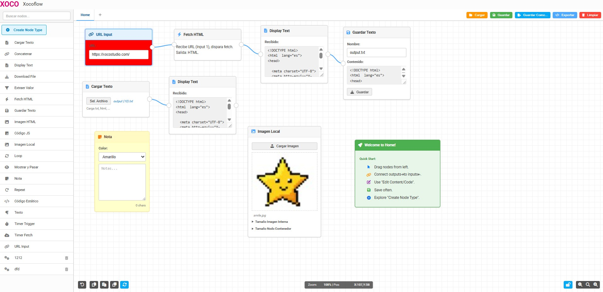

## XOCOFLOW Funcionamiento y flujo de trabajo

## Acceso Rápido a la Aplicación
[[XOCOFLOW - Demo en vivo](ttps://xococode.github.io/xocoflow/)](https://xococode.github.io/xocoflow/)

Unicornio 3D CAD es una aplicación web que permite crear, editar y manipular modelos 3D de forma intuitiva y visual. Utiliza la librería Three.js para renderizado en 3D y ofrece herramientas avanzadas de modelado y dibujo en 2D y 3D.

### Paleta de nodos (sidebar izquierdo)
- Buscador y lista de tipos de nodo disponibles: texto, concatenar, fetch, temporizadores, código JavaScript, carga/descarga de ficheros, etc. :contentReference[oaicite:0]{index=0}:contentReference[oaicite:1]{index=1}  
- Arrastra el nodo al canvas para empezar a construir tu flujo. :contentReference[oaicite:2]{index=2}:contentReference[oaicite:3]{index=3}

### Canvas principal
- Área donde se colocan y enlazan los nodos. :contentReference[oaicite:4]{index=4}:contentReference[oaicite:5]{index=5}  
- Conexiones gráficas entre entradas (inputs) y salidas (outputs) para definir el paso de datos. :contentReference[oaicite:6]{index=6}:contentReference[oaicite:7]{index=7}

### Menú superior (gestión de proyectos y módulos)
- **Cargar (Ctrl + O):** abre un JSON previamente guardado. :contentReference[oaicite:8]{index=8}:contentReference[oaicite:9]{index=9}  
- **Guardar (Ctrl + S):** salva el proyecto actual bajo el nombre activo. :contentReference[oaicite:10]{index=10}:contentReference[oaicite:11]{index=11}  
- **Guardar como… (Ctrl + Shift + S):** pide un nuevo nombre para exportar. :contentReference[oaicite:12]{index=12}:contentReference[oaicite:13]{index=13}  
- **Exportar JSON:** obtiene el JSON crudo del flujo para integraciones externas. :contentReference[oaicite:14]{index=14}:contentReference[oaicite:15]{index=15}  
- **Limpiar módulo:** elimina todos los nodos del módulo activo. :contentReference[oaicite:16]{index=16}:contentReference[oaicite:17]{index=17}  
- Soporta múltiples “módulos” (pestañas) dentro de un mismo proyecto. :contentReference[oaicite:18]{index=18}:contentReference[oaicite:19]{index=19}

### Controles inferiores
#### Historial y edición (izquierda)
- Deshacer/Rehacer, Copiar/Pegar/Duplicar nodos, Recalcular flujo. :contentReference[oaicite:20]{index=20}:contentReference[oaicite:21]{index=21}  
- Muestran iconos y tooltips con atajos. :contentReference[oaicite:22]{index=22}:contentReference[oaicite:23]{index=23}

#### Lock & Zoom (derecha)
- Bloquear/desbloquear edición para evitar cambios accidentales. :contentReference[oaicite:24]{index=24}:contentReference[oaicite:25]{index=25}  
- Zoom in/out/reset en el canvas. :contentReference[oaicite:26]{index=26}:contentReference[oaicite:27]{index=27}

### Barra de estado
- Muestra el nivel de zoom y la posición del nodo seleccionado en tiempo real. :contentReference[oaicite:28]{index=28}:contentReference[oaicite:29]{index=29}

### Editor de código (sidebar derecho)
- Para nodos de tipo “texto” o “javascript_code”, abre un panel con CodeMirror donde editar scripts o plantillas HTML/CSS/JS en contexto. :contentReference[oaicite:30]{index=30}:contentReference[oaicite:31]{index=31}

---

## Teclas rápidas principales

| Atajo               | Acción                                              |
|---------------------|-----------------------------------------------------|
| Ctrl + Z            | Deshacer última acción. :contentReference[oaicite:32]{index=32} |
| Ctrl + Y            | Rehacer. :contentReference[oaicite:33]{index=33}               |
| Ctrl + C            | Copiar nodo seleccionado. :contentReference[oaicite:34]{index=34} |
| Ctrl + V            | Pegar nodo copiado. :contentReference[oaicite:35]{index=35}    |
| Ctrl + D            | Duplicar nodo seleccionado. :contentReference[oaicite:36]{index=36} |
| Ctrl + R            | Recalcular flujo del módulo actual. :contentReference[oaicite:37]{index=37} |
| Ctrl + S            | Guardar proyecto. :contentReference[oaicite:38]{index=38}        |
| Ctrl + Shift + S    | Guardar proyecto como… :contentReference[oaicite:39]{index=39} |
| Ctrl + O            | Cargar proyecto desde JSON. :contentReference[oaicite:40]{index=40} |
| Supr / Backspace    | Eliminar nodo seleccionado. :contentReference[oaicite:41]{index=41}:contentReference[oaicite:42]{index=42}         |
| Escape              | Cerrar modales o deseleccionar nodos. :contentReference[oaicite:43]{index=43}:contentReference[oaicite:44]{index=44}  |

---

## Casos de uso y quién puede beneficiarse

- **Automatización de tareas:** programar fetch de datos, temporizadores, loops, disparadores basados en tiempo. :contentReference[oaicite:45]{index=45}:contentReference[oaicite:46]{index=46}  
- **Procesamiento de texto:** concatenar cadenas, extraer valores con expresiones regulares, mostrar resultados. :contentReference[oaicite:47]{index=47}:contentReference[oaicite:48]{index=48}  
- **Prototipado de APIs:** configurar nodos de fetch y visualizar respuestas HTML/JSON. :contentReference[oaicite:49]{index=49}:contentReference[oaicite:50]{index=50}  
- **Generación y descarga de archivos:** cargar/guardar texto o binarios directamente desde el flujo. :contentReference[oaicite:51]{index=51}:contentReference[oaicite:52]{index=52}  
- **Creación de diagramas de lógica:** ideal para educadores, formadores y presentaciones visuales de algoritmos. :contentReference[oaicite:53]{index=53}:contentReference[oaicite:54]{index=54}  
- **Desarrollo de integraciones low-code:** diseñadores de procesos, analistas de datos y desarrolladores que quieren un entorno rápido y visual. :contentReference[oaicite:55]{index=55}:contentReference[oaicite:56]{index=56}  

En resumen, **Xocoflow** interesa a cualquier profesional o entusiasta que quiera diseñar, documentar y ejecutar flujos de trabajo de manera visual, combinando nodos predefinidos y scripts a medida, sin renunciar al control que brinda el código cuando se necesita. :contentReference[oaicite:57]{index=57}:contentReference[oaicite:58]{index=58}  
